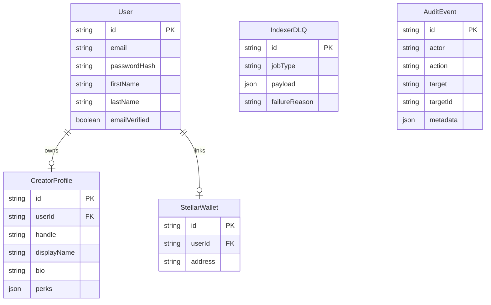

# Backend Domain Model and Endpoint Boundaries

This document outlines the core backend entities, their relationships, and the boundaries between different modules in the Access Layer Server.

## Domain Model

The following diagram illustrates the core entities and their relationships within the system:

### Core Entities

1. **User**: Represents a registered user. Holds authentication and basic profile data.
2. **CreatorProfile**: Represents the creator persona of a user. Tied to a specific handle and contains metadata like bio and perks. See [Creator Data Model Reference](./creator-data-model.md) for field-level types, constraints, and required/optional rules.
3. **StellarWallet**: Links a user to their Stellar public address. Used for identity verification and ownership checks.
4. **IndexerDLQ**: Stores failed indexing jobs from the Stellar blockchain for manual review or reprocessing.
5. **AuditEvent**: A generic log for significant actions occurring in the system.

## Module Boundaries

The server is organized into feature-based modules under `src/modules/`. Each module is responsible for its own business logic, routes, and (where applicable) data validation.

### Major Route Groups

| Module     | Responsibility                                                                | Primary Entities |
| :--------- | :---------------------------------------------------------------------------- | :--------------- |
| `auth`     | User registration, login, session management, and password resets.            | `User`           |
| `creators` | Public and private creator profile management, including stats and discovery. | `CreatorProfile` |
| `wallet`   | Linking and verifying Stellar wallets.                                        | `StellarWallet`  |
| `admin`    | Internal management tools and system monitoring.                              | All              |
| `health`   | System health checks and status monitoring.                                   | N/A              |

### Cross-Module Rules

To ensure a maintainable and decoupled architecture, the following rules apply:

1. **No Direct Database Access**: Modules should not directly query Prisma models belonging to other modules if a service/utility exists.
2. **Shared Utilities**: Common logic (e.g., mail sending, logging, pagination) belongs in `src/utils/` and can be used by any module.
3. **Constants**: Shared configuration and string constants belong in `src/constants/`.
4. **Types**: Cross-cutting TypeScript types belong in `src/types/`.

### Interaction Patterns

- **Initialization**: `src/app.ts` assembles the modules and registers global middlewares.
- **Data Sharing**: If a module needs data from another (e.g., `creators` needing user info), it should use the Prisma client (which is shared) but respect the logical boundaries defined in the schema files.
